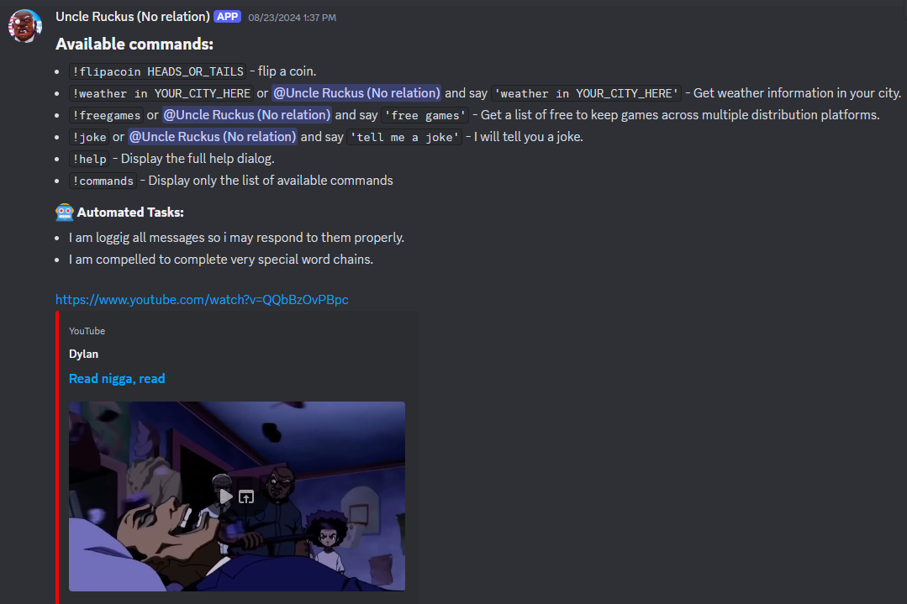

<h1 align="center">
  <a href="https://github.com/jtmb">
    
  </a>
</h1>


<div align="center">
  <b>ruckus-bot</b> - A full stack discord bot in the likeness of Uncle Ruckus built in nodeJS.
  <br />
  <br />
  <a href="https://github.com/jtmb/ip_check/issues/new?assignees=&labels=bug&title=bug%3A+">Report a Bug</a>
  ·
  <a href="https://github.com/jtmb/ip_check/issues/new?assignees=&labels=enhancement&template=02_FEATURE_REQUEST.md&title=feat%3A+">Request a Feature</a>
  .
  <a href="https://hub.docker.com/repository/docker/jtmb92/cloudflare_ip_checker/general">Docker Hub</a>
</div>
<br>
<details open="open">
<summary>Table of Contents</summary>

- [About](#about)
    - [Highlighted Features](#highlighted-features)
- [Prerequisites](#prerequisites)
- [Getting Started](#getting-started)
    - [Docker Image](#docker-image)
    - [Running on Docker Compose](#running-on-docker-compose)
- [Environment Variables Explained](#environment-variables-explained)
- [Contributing](#contributing)
- [License](#license)

</details>
<br>

---

### <h1>About</h1>

A full stack discord bot written in the likeness of uncle ruckus from the boondocks.

> [!WARNING]  
> Ruckus is a fictional joke character from  [The Boondocks TV Series](https://en.wikipedia.org/wiki/The_Boondocks_(TV_series)) and in no way shape or form represents or is affiliated with the values of the creator of the ruckus-bot application.

### Highlighted Features:

- <b>nodeJS!</b> The bot, api and front end are built on top of nodeJS, ensuring maximum compatibility across the entire stack.
- <b>User-friendly Dashboard</b> for monitoring your bot.
- <b>Full Integration with Discord</b>.
- <b>Fast</b> - API request total time on average is less than a second.
- <b>Lightweight</b> - Alpine Container keeps the image size small.
- <b>Scalable</b> - Built with scale in mind, Docker Swarm and kubernetes compatible.


    <div style="display: flex; flex-wrap: wrap; gap: 10px;">
    
    
    </div>


## Prerequisites

- Docker installed on your system

### <h2>Getting Started</h2>
### [Docker Image](https://hub.docker.com/r/jtmb92/ez-backups)
```docker
 docker pull jtmb92/ruckus-bot
```
### Running on docker-compose
Run on Docker Compose (this is the recommended way) by running the command "docker compose up -d".

```yaml
version: '3.8'

services:
  bot:
    image: jtmb92/ruckus-bot:latest
    environment:
      - MYSQL_HOST: db
      - MYSQL_PORT: 3306
      - MYSQL_USER: bot
      - MYSQL_PASSWORD: your-password-here
      - MYSQL_DATABASE: db
      - BOT_TOKEN: your-discord-bot-token
    ports:
      - "8080:8080"
  db:
    image: mysql:5.7
    volumes:
      - mysql_data:/var/lib/mysql
    environment:
      - MYSQL_DATABASE: db
      - MYSQL_USER: bot
      - MYSQL_PASSWORD: your-password-here
      - MYSQL_RANDOM_ROOT_PASSWORD: 1

volumes:
  mysql_data:
```


## Environment Variables explained

```yaml
    MYSQL_HOST: 'db'
```  
The host to connect to MYSQL, keep this the same as your database service name as it uses docker internal networking to reach the DB, no need to expose DB ports.
```yaml
   MYSQL_USER: 'bot'
```     
The user to connect to the DB with, keep this uniform across both the DB and the bot.
```yaml
    MYSQL_PASSWORD: 'your-password-here'
```      
The password to connect to the DB with, keep this uniform across both the DB and the bot.
```yaml
    - MYSQL_DATABASE: 'db'
```     
The DB the bot container is to connect to keep this uniform across both the DB and the bot.
```yaml
    BOT_TOKEN: 'your-discord-bot-token'
```      
Your discord bot token, you can generate one [here](https://discord.com/developers/applications).

```yaml
    MYSQL_RANDOM_ROOT_PASSWORD: 1
```    
The root password for the DB, will be randomly generated as it is not used. Your `MYSQL_USER` will have all the permissions necessary.

## Contributing

First off, thanks for taking the time to contribute! Contributions are what makes the open-source community such an amazing place to learn, inspire, and create. Any contributions you make will benefit everybody else and are **greatly appreciated**.

Please try to create bug reports that are:

- _Reproducible._ Include steps to reproduce the problem.
- _Specific._ Include as much detail as possible: which version, what environment, etc.
- _Unique._ Do not duplicate existing opened issues.
- _Scoped to a Single Bug._ One bug per report.

## License

This project is licensed under the **GNU GENERAL PUBLIC LICENSE v3**. Feel free to edit and distribute this template as you like.

See [LICENSE](LICENSE) for more information. 

